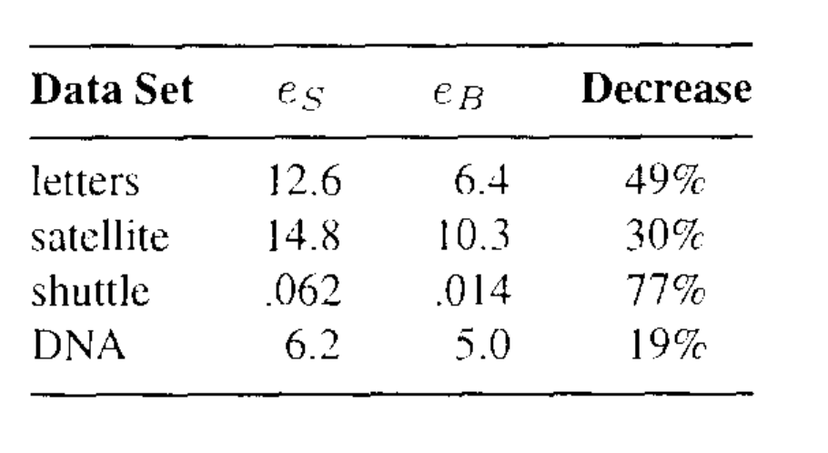

## DECISION TREE

A decision tree is a non-parametric supervised learning algorithm, that is utilized for both classification and regression tasks.
It has a hierarchical, tree structure, which consists of a root node, branches, internal nodes and leaf nodes.

{width="500px," height="300px"}

Decision tree learning employs a divide and conquer strategy by conducting a greedy search to identify the optimal split points within a tree.
This process of splitting is then repeated in a top-down, recursive manner until all, or the majority of records have been classified under specific class labels.
Whether or not all data points are classified as homogeneous sets is largely dependent on the complexity of the decision tree.
Smaller trees are more easily able to attain pure leaf nodes---i.e.
data points in a single class.
However, as a tree grows in size, it becomes increasingly difficult to maintain this purity, and it usually results in too little data falling within a given subtree.
When this occurs, it is known as data fragmentation, and it can often lead to overfitting.
As a result, decision trees have preference for small trees.
Decision trees can maintain their accuracy is by forming an ensemble via a random forest algorithm; this classifier predicts more accurate results, particularly when the individual trees are uncorrelated with each other.
It is explained further in the following section.

Decision Trees are broadly classified into 3: ID3, C4.5,CHAID,MARS, CART. In this paper we are going to explore only about CART.

CART is a predictive algorithm used in Machine Learning and it explains how the target variable's values can be predicted based on other matters.
It is a decision tree where each fork is split into a predictor variable and each node has a prediction for the target variable at the end.

CART is includes two decision trees:

-   **Classification Tree** which is used to predict categorical decision.

-   **Regression Tree** which is used to predict continuous value decision.

### CLASSIFICATION TREE

A classification tree is an algorithm where the target variable is categorical.
The algorithm is then used to identify the "Class" within which the target variable is most likely to fall.
Classification trees are used when the dataset needs to be split into classes that belong to the response variable(like yes or no).
In use, the decision process starts at the trunk and follows the branches until a leaf is reached.

A classification tree model is created as and example and an example is available after the explanation of the trees.

### REGRESSION TREE

Regression trees divide the data into subsets, that is, branches, nodes, and leaves.
Like decision trees, regression trees select splits that decrease the dispersion of target attribute values.
Thus, the target attribute values can be predicted from their mean values in the leaves.

The resulting model is piecewise-constant.
It has fixed predicted values that are assigned to regions for which the domain is split by the tree structure.
Regression tree growing is done by creating a regression tree from a data set.
To minimize the dispersion of target attributes, splits are selected.
At the same time, target values are assigned to leaves when no further splits are required or possible.
Regression tree prediction uses a previously grown regression tree to predict the attribute values of a target for a data set.

## BAGGING DECISION TREE

{width="600px," height="350px"}

The bootstrap is used in many situations in which it is hard or even impossible to directly compute the standard deviation of a quantity of interest.Here the bootstrap can be used in order to improve statistical learning methods such as decision trees.
The decision trees suffer from high variance.
Bootstrap aggregation, or bagging, is a general-purpose procedure for reducing the variance of a statistical learning method; we introduce it here because it is particularly useful and frequently used in the context of decision trees.
Given a set of $\mathit{n}$ n independent observations $\mathit{Z_1}$,...,$\mathit{Z_n}$, each with variance $\sigma^2$, the variance of the mean $\overline{\mathit{Z}}$ of the observations is given by $\sigma^2$/$\mathit{n}$.
In other words, averaging a set of observations reduces variance.
Hence a natural way to reduce the variance and increase the test set accuracy of a statistical learning method is to take many training sets from the population, build a separate prediction model using each training set, and average the resulting predictions.

### BAGGING CLASSIFICATION TREE

Classification trees are decision trees in which the target variables can take categorical values.
Classification trees use modified split selection criteria and stopping criteria.
By using a Classification tree, you can explain the decisions, identify possible events that might occur, and see potential outcomes.
The analysis helps you determine what the best decision would be.
The steps to follow to perform a bagged classification tree and compare it with classification tree is as follows.

The dataset sample is split into learning(30%) and test(70%) set.
A classification tree is constructed from the learning set using 10-fold cross-validation.
Running the test set down this tree gives the squared error.
A bootstrap sample $\mathcal{L_B}$ is selected from $\mathcal{L}$ and a tree grown using $\mathcal{L_B}$ and $\mathcal{L}$ used to select the pruned subtree.
This is repeated 50 times giving tree predictors $\phi_{1}(x)$,...,$\phi_{50}(x)$.The bagged predictor is estimates as which class has the plurality in $\phi_{1}(x)$,...,$\phi_{50}(x)$.
That is by the highest number of votes or taking the class with highest probability in $\phi_{1}(x)$,...,$\phi_{50}(x)$.The proportion of times the estimated class differs from the true class is the bagging misclassification rate $\mathit{e_B(L,T)}$.The random division of the data into L and T is repeated 100 times and giving the result $\mathit{\bar{e_s}}$,$\mathit{\bar{e_B}}$.

### BAGGING REGRESSION TREE

Regression trees are decision trees in which the target variables can take continuous values.
Regression trees use modified split selection criteria and stopping criteria.
By using a regression tree, you can explain the decisions, identify possible events that might occur, and see potential outcomes.
The analysis helps you determine what the best decision would be.
To divide the data into subsets, regression tree models use nodes, branches, and leaves.
The steps to follow to perform a bagged regression tree is same as bagged classification tree.
The dataset sample is split into learning(10%) and test(90%) set.
A regression tree is constructed from the learning set using 10-fold cross-validation.
Running the test set down this tree gives the squared error.
A bootstrap sample $\mathcal{L_B}$ is selected from $\mathcal{L}$ and a tree grown using $\mathcal{L_B}$ and $\mathcal{L}$ used to select the pruned subtree.
This is repeated 25 times giving tree predictors $\phi_{1}(x)$,...,$\phi_{25}(x)$.The bagged predictor is $\hat{\mathit{y_n}}$ = $\mathit{av_k}\phi_{k}(x_n)$, and the squared error $\mathit{e_B(\mathcal{L,T})}$ is $\mathit{av_n(y_n-\hat{y_n})^2}$.
The random division of the data into $\mathcal{L}$ and $\mathcal{T}$ is repeated 100 times and the errors averaged giving the result $\mathit{\bar{e_s}}$,$\mathit{\bar{e_B}}$.
There is a decrease in error even in this case.

## **RANDOM FOREST**

Random forests are an improvement over bagged trees that aim to make the trees less similar to each other.
In bagging, we create multiple decision trees using different training samples.
However, in random forests, when building these trees, we make a small change.
Instead of considering all predictors at each split, we randomly select a subset of predictors and choose only one from that subset for the split.
We refresh this subset for each split, usually picking the square root of the total number of predictors.

This tweak is done because in bagged trees, if there is a strong predictor in the dataset, most or all of the trees will use that predictor in the top split.
As a result, the predictions from these trees will be highly correlated.
Unfortunately, averaging highly correlated predictions doesn't reduce the variability as much as averaging uncorrelated predictions.
Therefore, bagging doesn't significantly reduce the variance compared to a single tree in such cases.

Random forests solve this problem by restricting each split to consider only a subset of predictors.
This means that, on average, a portion of the splits won't even consider the strong predictor.
By doing this, other predictors have a better chance to contribute to the splits.
This process "decorrelates" the trees, making their average less variable and more reliable.

The main difference between bagging and random forests lies in the choice of the predictor subset size.
If we use all predictors, it's equivalent to bagging.
However, when using the square root of the total predictors, random forests show a reduction in the test error.

Using a small subset of predictors is particularly helpful when we have many correlated predictors.

Just like bagging, random forests don't overfit if we increase the number of trees (denoted as B).
Therefore, in practice, a sufficiently large value of B is used until the error rate stabilizes.

In the process of constructing a random forest, multiple decision trees are created.
Each tree is generated independently, and for each tree, a random vector $\Theta_k$ is generated.
The generation of $\Theta_k$ is unrelated to the previously generated random vectors $\Theta_1,...,\Theta_{k-1}$, but they are all drawn from the same distribution.

To grow a tree, the training set and the corresponding $\Theta_k$ are used.
This combination results in a classifier h(**x**, $\Theta_k$), where **x** represents an input vector.
In bagging, for example, $\Theta$ is generated by counting the number of darts that randomly fall into N boxes, with N being the number of examples in the training set.
In random split selection, the content of $\Theta$ depends on its usage in constructing the tree.

Once a large number of trees are generated, they collectively contribute to the final classification decision.
Each tree casts a vote, and the class with the highest number of votes is considered the most popular.
This aggregation of trees is what we refer to as a random forest.

A random forest is a classifier consisting of a collection of tree-structured classifiers {h(**x**,$\Theta_k$), k=1,...} where the {$\Theta_k$} are independent identically distributed random vectors and each tree casts a unit vote for the most popular class at input **x**.

```{r setup, include=FALSE}
knitr::opts_chunk$set(echo = TRUE)
library(caret)
library(randomForest)
```

We are going to use diabetes dataset gathered among the Pima Indians by the National Institute of Diabetes and Digestive and Kidney Diseases and compare the result of classification tree, bagged and random forest.

```{r}
misclassification_rate_vec <- rep(0,100)
misclassification_rate_vec_rf <- rep(0,100)
misclassification_rate_vec_bagged<- rep(0,100)

E_sim <- read.table('diabetes.csv',sep=',',header = TRUE)
E_sim$Outcome<- as.factor(E_sim$Outcome)

head(E_sim)
```

The dataset consists of 768 cases, 8 variables and two classes.
The variables are medical measurements on the patient plus age and pregnancy information.
The classes are: tested positive for diabetes (268) or negative (500).

In the simulated data, Breiman uses 300 samples as learning set from the 1800 samples generated.
However we are going to use the raw dataset and split the dataset into 2 - a learning set, L, (10% of the data) with 76 rows and a test set, T, (90% of the data) with 692 rows.
Next we will construct the classification tree model using train() function with 10-fold cross-validation.
A bagged classification tree is created in parallel using the function randomForest() and setting the number of trees as 25 and mtry (the number of variables used) as 8.
Last we create a Random Forest model using the same function but here we mtry as 3 ($\sqrt{8}$).
So the best 3 variables among the 8 will be chosen.\

The three models are made to predict the result using the test dataset T and the miscalculation rate is calculated.
The whole process is iterated 100 times for different combination of learning and test data and the mean error is calculated.

```{r}
for (i in 1:100){
  index <- createDataPartition(E_sim$Outcome, p = 0.7, list = FALSE)

  # Divide the data into test set T and learning set L
  T <- E_sim[-index, ]
  L <- E_sim[index, ]
  
  # Train the classification tree model with 10-fold cross-validation 
  modeldt <- train(
    Outcome ~ ., 
    data = L, 
    method = "rpart", 
    trControl = trainControl(method = "cv", number = 10)
  )
  
  rf_model <- randomForest(Outcome ~ ., data = L,mtry = 3, importance=TRUE)
  bagged_tree<- randomForest(Outcome ~ ., data = L,mtry = 8, ntree = 50)

  

  # Predict the class labels for the test set using the trained model
  predictions <- predict(modeldt, newdata = T)
  # Calculate misclassification rate
  misclassification_rate <- mean(predictions != T$Outcome)
  misclassification_rate_vec[i] <- misclassification_rate
  
  
  predictions_rf <- predict(rf_model, newdata = T)
  # Calculate misclassification rate
  misclassification_rate_rf <- mean(predictions_rf != T$Outcome)
  misclassification_rate_vec_rf[i] <- misclassification_rate_rf
  
  predictions_bagged <- predict(bagged_tree, newdata = T)
  # Calculate misclassification rate
  misclassification_rate_bagged <- mean(predictions_bagged != T$Outcome)

  misclassification_rate_vec_bagged[i] <- misclassification_rate_bagged
  
}


```

```{r}
mis<- mean(misclassification_rate_vec)
mis_rf <- mean(misclassification_rate_vec_rf)
mis_bagg <- mean(misclassification_rate_vec_bagged)
err_data <- data.frame(Model = c("Classification Tree", "Bagging Predictor", "Random Forest"),
                       Error = c(mis,mis_bagg,mis_rf)) 
err_data
```

From the table above we can see that the Error is maximum for Classification Tree and least for Random Forest.
Bagged Predictor model performs better than Classification Tree i.e. it can reduce the variance of an unstable dataset.

**Larger Data Sets**

For large dataset that is dataset with more than 2000 samples, 10% of the data is set aside as training set and the remaining 90% as learning set.The set aside 10% was then used to select the best pruned subtree.In bagging, 50 bootstrap replicates of the training set were generated and a large tree grown on each one.
The error rate given in the paper shown below.

{width="500px," height="200px"}

The percentage of decrease in misclassification rate is similar to the rate of difference in small dataset.
But if we have a closer look at the errors, the error for large dataset is very much small and the improvement is not extremely significant.
