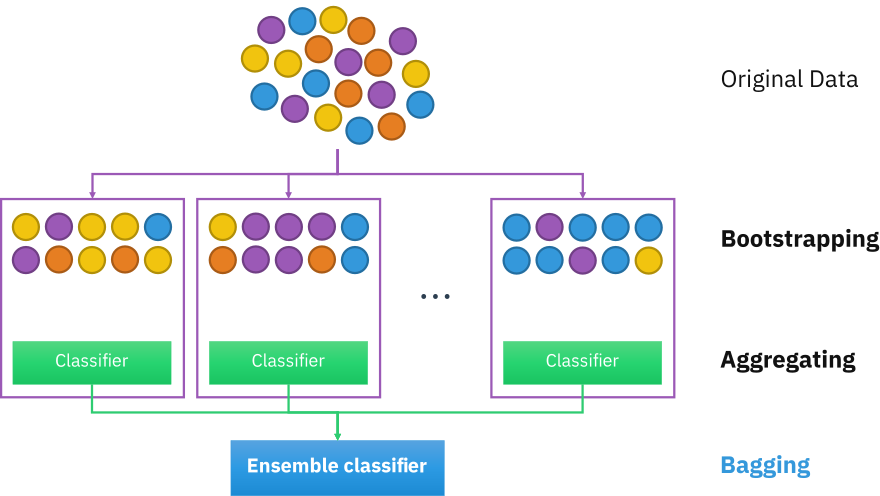

**INTRODUCTION**

Bagging predictors is a method for generating multiple versions of a predictor and using these to get an aggregated predictor.
The aggregation averages over the versions when predicting a numerical outcome and does a plurality vote when predicting a class.
The multiple versions are formed by making bootstrap replicates of the learning set and using these as new learning sets.
The vital element is the instability of the prediction method.
If perturbing the learning set can cause significant changes in the predictor constructed, then bagging can improve accuracy.
$\mathcal{L}$ A learning set $\mathcal{L}$ consists of data {($\mathit{y_n}$, $\mathit{x_n}$),$\mathit{n}$ = 1....
, $\mathit{N}$}

$\mathit{y}$ : class labels/numeric responses

$\mathit{x}$ : input

$\varphi(\mathit{x},\mathcal{L})$ : predictor

$\mathcal{L_k}$ : sequence of learning sets consisting of N independent observations from the same underlying distribution as $\mathcal{L}$.

Our scope of this project is to show that the sequence of predictors $\varphi(\mathit{x},\mathcal{L_k})$ is a better predictor than $\varphi(\mathit{x},\mathcal{L})$.

-   $\mathit{y}$ is numeric

    Replace $\varphi(\mathit{x},\mathcal{L})$ by the average of $\varphi(\mathit{x},\mathcal{L_k})$.
    In other words find the expecation of the predictor over $\mathcal{L}$ .

-   $\mathit{y}$ is class labels

-   

CLASSIFICATION TREE
A classification tree is a structural mapping of binary decisions that lead to a decision about the class (interpretation) of an object (such as a pixel).
Although sometimes referred to as a decision tree, it is more properly a type of decision tree that leads to categorical decisions.
A regression tree, another form of decision tree, leads to quantitative decisions.

{width="500"}
A classification tree is composed of branches that represent attributes, while the leaves represent decisions. In use, the decision process starts at the trunk and follows the branches until a leaf is reached.For a classification tree, we predict that each observation belongs to the most commonly occurring class of training observations in the region to which it belongs. In interpreting the results of a classification tree, we are often interested not only in the class prediction corresponding to a particular terminal node region, but also in the class proportions among the training observations that fall into that region.
The task of growing a classification tree is quite similar to the task of growing a regression tree. Just as in the regression setting, we use recursive binary splitting to grow a classification tree. However, in the classification setting, RSS (Residual Sum Square) cannot be used as a criterion for making the binary splits.
The classification tree suffer from high variance. This means that if we split the training data into two parts at random, and fit a classification tree to both halves, the results that we get could be quite different. In contrast, a procedure with low variance will yield similar results if applied repeatedly to distinct data sets; linear regression tends to have low variance, if the ratio of n to p is moderately large

Bagging

The bootstrap is used in many situations in which it is hard or even impossible to directly compute the standard deviation of a quantity of interest.Here the bootstrap can be used in order to improve statistical learning methods such as decision trees. The decision trees suffer from high variance. Bootstrap aggregation, or bagging, is a general-purpose procedure for reducing the variance of a statistical learning method; we introduce it here because it is particularly useful and frequently used in the context of decision trees.
{width="500"}

Given a set of $\mathit{n}$  n independent observations $\mathit{Z_1}$,...,$\mathit{Z_n}$, each with variance $\sigma^2$, the variance of the mean $\overline{\mathit{Z}}$  of the observations is given by $\sigma^2$/$\mathit{n}$. In other words, averaging a set of observations reduces variance. Hence a natural way to reduce the variance and increase the test set accuracy of a statistical learning method is to take many training sets from the population, build a separate prediction model using each training set, and average the resulting predictions.


```{r setup, include=FALSE}
knitr::opts_chunk$set(echo = TRUE)
library(caret)
library(randomForest)
```

We are going to use diabetes dataset compare the result of decision tree and random forest.
Random forest is also known as bagged decision tree.
The random forest is a classification algorithm consisting of many decisions trees.
It uses bagging and feature randomness when building each individual tree to try to create an uncorrelated forest of trees whose prediction by committee is more accurate than that of any individual tree.

```{r}


misclassification_rate_vec <- rep(0,100)
misclassification_rate_vec_rf <- rep(0,100)
misclassification_rate_vec_bagged<- rep(0,100)

#E_sim <- read.table('/Users/anujaabraaham/Downloads/diabetes.csv',sep = ',',header = TRUE)
E_sim <- read.table('diabetes.csv',sep=',',header = TRUE)
E_sim$Outcome<- as.factor(E_sim$Outcome)

head(E_sim)
```

This is a data base gathered among the Pima Indians by the National Institute of Diabetes and Digestive and Kidney Diseases.
The data base consists of 768 cases, 8 variables and two classes.
The variables are medical measurements on the patient plus age and pregnancy information.
The classes are: tested positive for diabetes (268) or negative (500).

As per how Breiman did the analysis we followed a similar pattern with raw data instead of simulated data.
The data is split into 2 a learning set, L, (10% of the data) with 76 rows and a test set, T, (90% of the data) with 692 rows.
Next we will train the decision tree model using train() function with 10-fold cross-validation.
A bagged decision tree aka random forest model is created in parallel using the function randomForest().
The two models are made to predict the result using the same dataset and the error is calculated.
The whole process is iterated 100 times for different combination of learning and test data and the mean error is calculated.

```{r}
for (i in 1:100){
  index <- createDataPartition(E_sim$Outcome, p = 0.7, list = FALSE)

  # Divide the data into test set T and learning set L
  T <- E_sim[-index, ]
  L <- E_sim[index, ]
  
  # Train the classification tree model with 10-fold cross-validation 
  modeldt <- train(
    Outcome ~ ., 
    data = L, 
    method = "rpart", 
    trControl = trainControl(method = "cv", number = 10)
  )
  
  rf_model <- randomForest(Outcome ~ ., data = L,mtry = 4, importance=TRUE)
  bagged_tree<- randomForest(Outcome ~ ., data = L,mtry = 8, ntree = 25)

  

  # Predict the class labels for the test set using the trained model
  predictions <- predict(modeldt, newdata = T)
  # Calculate misclassification rate
  misclassification_rate <- mean(predictions != T$Outcome)
  misclassification_rate_vec[i] <- misclassification_rate
  
  
  predictions_rf <- predict(rf_model, newdata = T)
  # Calculate misclassification rate
  misclassification_rate_rf <- mean(predictions_rf != T$Outcome)
  misclassification_rate_vec_rf[i] <- misclassification_rate_rf
  
  predictions_bagged <- predict(bagged_tree, newdata = T)
  # Calculate misclassification rate
  misclassification_rate_bagged <- mean(predictions_bagged != T$Outcome)

  misclassification_rate_vec_bagged[i] <- misclassification_rate_bagged
  
}


```

```{r}
rpart.plot(modeldt,extra=106)
```

```{r}
mis<- mean(misclassification_rate_vec)
mis_rf <- mean(misclassification_rate_vec_rf)
mis_bagg <- mean(misclassification_rate_vec_bagged)
mis
mis_rf
mis_bagg
```

From the result it is clear that the model using bagged predictor is better than the model without the bagged predictor.
Bagged predictor works better for unstable classifiers than for stable ones.
