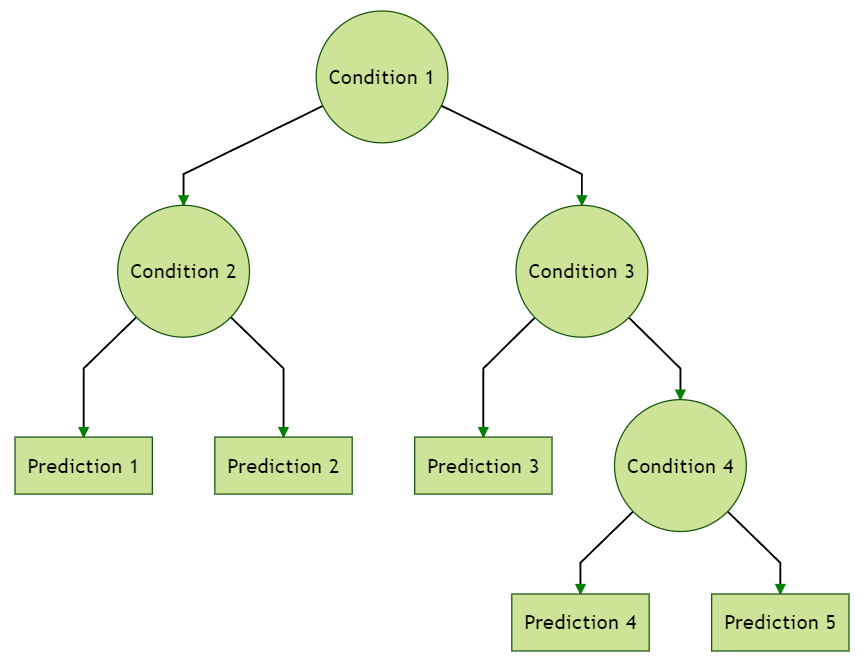
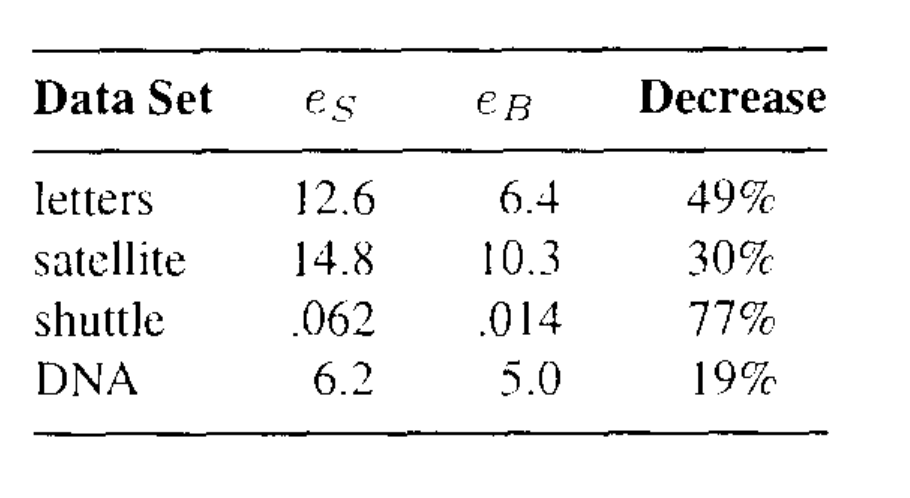
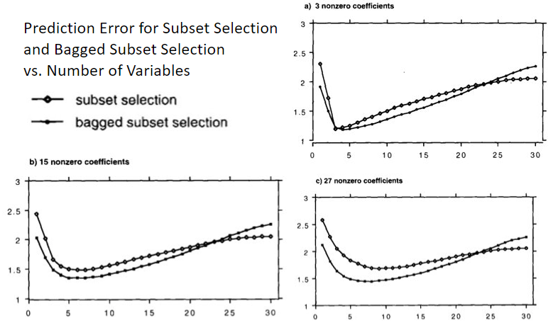
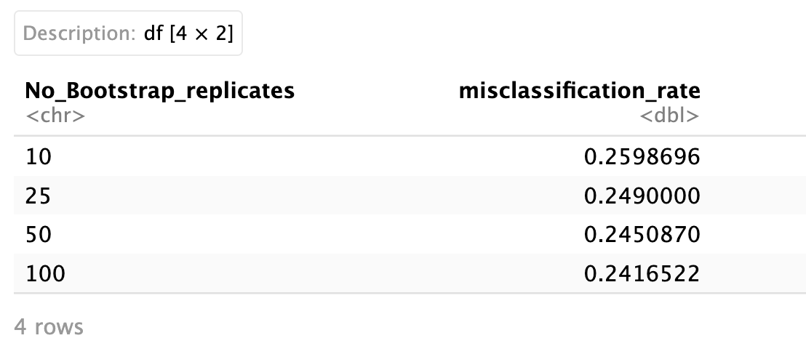

**INTRODUCTION**

In a typical prediction problem, there is a trade-off between two factors: bias and variance.
Bias refers to the error introduced by simplifying assumptions in a model, while variance refers to the amount by which predictions vary for different samples of data.
When we try to improve the fit of a model, there comes a point where increasing the precision of the fit leads to higher variance in predictions for future observations.
On the other hand, reducing prediction variance can result in a higher expected bias for future predictions.
To address this trade-off, Breiman (1996) introduced a technique called bagging, which stands for "Bootstrap AGGregatING." The idea behind bagging is simple.
Instead of relying on a single model fit to the observed data for making predictions, multiple bootstrap samples (randomly selected subsets) of the data are created.
Each of these samples is used to fit a model, and the predictions from all the fitted models are averaged to obtain the bagged prediction.
Breiman explains that bagging works particularly well for modeling procedures that are sensitive to small changes in the data, such as classification and regression trees (CART).
He also provides a theoretical explanation of how bagging reduces the mean-squared prediction error for such unstable procedures.
Unstable classifiers, such as trees, characteristically have high variance and low bias.
Stable classifiers have low variance, but can have high bias.
Instability is an essential ingredient for bagging to improve accuracy.
We have a learning set ($\mathcal{L}$) with data points {$(y_n, x_n)$} for training a predictor ($\phi(x,\mathcal{L})$).
To improve the predictor, we use a sequence of learning sets {$\mathcal{L_k}$} drawn from the same distribution as $\mathcal{L}$.
We only have access to the predictors {$\phi(x, \mathcal{L_k})$}.
For numerical responses, we average the predictors $\phi(x, \mathcal{L_k})$ to get an aggregated predictor $\phi_A(x)$.For class labels, we use voting among the predictors $\phi(x, \mathcal{L_k})$ to form the aggregated predictor $\phi_A(x)$.
If we don't have multiple learning sets, we mimic the process using repeated bootstrap sampling from $\mathcal{L}$ to create bootstrap replicates {$\mathcal{L}^{(B)}$}.
We form predictors ${\phi(x, \mathcal{L}^{(B)})}$ using these replicates.
For numerical responses, the aggregated predictor is $\phi_B(x)$, which is the average of the predictors $\phi(x,\mathcal{L}^{(B)}$.
For class labels, the aggregated predictor $\phi_B(x)$ is determined by voting among the predictors $\phi(x,\mathcal{L}^{(B)})$.
This paper aims to provide a comprehensive analysis and interpretation of Breiman's influential paper.
We focus on utilizing classification trees, specifically with the "diabetes" dataset mentioned in the paper, and supplement our findings with relevant code examples.
Additionally, we incorporate the random forest function and offer an explanation of its significance within our analysis.
Our discussion delves into the empirical evidence and insights put forth by Breiman to substantiate the effectiveness of bagging.
We explore the underlying principles and reasoning behind why bagging yields positive results, as outlined by Breiman.
Lastly, we present our conclusions based on our work, drawing comparisons between the Bootstrap method covered in our class and the findings from our analysis.
We aim to provide a concise yet comprehensive overview of our research, shedding light on the practical implications and significance of the discussed concepts.

**DECISION TREE**

A decision tree is a non-parametric supervised learning algorithm, that is utilized for both classification and regression tasks.
It has a hierarchical, tree structure, which consists of a root node, branches, internal nodes and leaf nodes.

{width="500px" height="200px"}

Decision tree learning employs a divide and conquer strategy by conducting a greedy search to identify the optimal split points within a tree.
This process of splitting is then repeated in a top-down, recursive manner until all, or the majority of records have been classified under specific class labels.
Whether or not all data points are classified as homogeneous sets is largely dependent on the complexity of the decision tree.
Smaller trees are more easily able to attain pure leaf nodes-i.e.
data points in a single class.However, as a tree grows in size, it becomes increasingly difficult to maintain this purity, and it usually results in too little data falling within a given subtree.
When this occurs, it is known as data fragmentation, and it can often lead to overfitting.
As a result, decision trees have preference for small trees.
Decision trees can maintain their accuracy is by forming an ensemble via a random forest algorithm; this classifier predicts more accurate results, particularly when the individual trees are uncorrelated with each other.
It is explained further in the following section.
Decision Trees are broadly classified into 3: ID3, C4.5,CHAID,MARS, CART. In this paper we are going to explore only about CART.
CART is a predictive algorithm used in Machine Learning and it explains how the target variable's values can be predicted based on other matters.
It is a decision tree where each fork is split into a predictor variable and each node has a prediction for the target variable at the end.
CART is includes two decision trees: **Classification Tree** which is used to predict categorical decision and **Regression Tree** which is used to predict continuous value decision.

A **classification tree** is an algorithm where the target variable is categorical.
The algorithm is then used to identify the "Class" within which the target variable is most likely to fall.
Classification trees are used when the dataset needs to be split into classes that belong to the response variable(like yes or no).
In use, the decision process starts at the trunk and follows the branches until a leaf is reached.
A classification tree model is created as and example and an example is available after the explanation of the trees.

**Regression trees** divide the data into subsets, that is, branches, nodes, and leaves.
Like decision trees, regression trees select splits that decrease the dispersion of target attribute values.Thus, the target attribute values can be predicted from their mean values in the leaves.
The resulting model is piece wise-constant.
It has fixed predicted values that are assigned to regions for which the domain is split by the tree structure.
Regression tree growing is done by creating a regression tree from a data set.
To minimize the dispersion of target attributes, splits are selected.
At the same time, target values are assigned to leaves when no further splits are required or possible.
Regression tree prediction uses a previously grown regression tree to predict the attribute values of a target for a data set.

**BAGGING DECISION TREE**

{width="500px" height="200px"}

The bootstrap is used in many situations in which it is hard or even impossible to directly compute the standard deviation of a quantity of interest.Here the bootstrap can be used in order to improve statistical learning methods such as decision trees.
The decision trees suffer from high variance.
Bootstrap aggregation, or bagging, is a general-purpose procedure for reducing the variance of a statistical learning method; we introduce it here because it is particularly useful and frequently used in the context of decision trees.
Given a set of $\mathit{n}$ n independent observations $\mathit{Z_1}$,...,$\mathit{Z_n}$, each with variance $\sigma^2$, the variance of the mean $\overline{\mathit{Z}}$ of the observations is given by $\sigma^2$/$\mathit{n}$.
In other words, averaging a set of observations reduces variance.
Hence a natural way to reduce the variance and increase the test set accuracy of a statistical learning method is to take many training sets from the population, build a separate prediction model using each training set, and average the resulting predictions.

**Bagging classification tree**

Classification trees are decision trees in which the target variables can take categorical values.
Classification trees use modified split selection criteria and stopping criteria.
By using a Classification tree, you can explain the decisions, identify possible events that might occur, and see potential outcomes.
The analysis helps you determine what the best decision would be.
The steps to follow to perform a bagged classification tree and compare it with classification tree is as follows.
The dataset sample is split into learning(30%) and test(70%) set.
A classification tree is constructed from the learning set using 10-fold cross-validation.
Running the test set down this tree gives the squared error.
A bootstrap sample $\mathcal{L_B}$ is selected from $\mathcal{L}$ and a tree grown using $\mathcal{L_B}$ and $\mathcal{L}$ used to select the pruned subtree.
This is repeated 50 times giving tree predictors $\phi_{1}(x)$,...,$\phi_{50}(x)$.The bagged predictor is estimates as which class has the plurality in $\phi_{1}(x)$,...,$\phi_{50}(x)$.
That is by the highest number of votes or taking the class with highest probability in $\phi_{1}(x)$,...,$\phi_{50}(x)$.The proportion of times the estimated class differs from the true class is the bagging misclassification rate $\mathit{e_B(L,T)}$.The random division of the data into$\mathcal{L}$and T is repeated 100 times and giving the result $\mathit{\bar{e_s}}$,$\mathit{\bar{e_B}}$.

**Bagging regression tree**

Regression trees are decision trees in which the target variables can take continuous values.
Regression trees use modified split selection criteria and stopping criteria.
By using a regression tree, you can explain the decisions, identify possible events that might occur, and see potential outcomes.
The analysis helps you determine what the best decision would be.
To divide the data into subsets, regression tree models use nodes, branches, and leaves.
The steps to follow to perform a bagged regression tree is same as bagged classification tree.
The dataset sample is split into learning(10%) and test(90%) set.
A regression tree is constructed from the learning set using 10-fold cross-validation.
Running the test set down this tree gives the squared error.
A bootstrap sample $\mathcal{L_B}$ is selected from $\mathcal{L}$ and a tree grown using $\mathcal{L_B}$ and $\mathcal{L}$ used to select the pruned subtree.
This is repeated 25 times giving tree predictors $\phi_{1}(x)$,...,$\phi_{25}(x)$.The bagged predictor is $\hat{\mathit{y_n}}$ = $\mathit{av_k}\phi_{k}(x_n)$, and the squared error $\mathit{e_B(\mathcal{L,T})}$ is $\mathit{av_n(y_n-\hat{y_n})^2}$.
The random division of the data into $\mathcal{L}$ and $\mathcal{T}$ is repeated 100 times and the errors averaged giving the result $\mathit{\bar{e_s}}$,$\mathit{\bar{e_B}}$.
There is a decrease in error even in this case.

**RANDOM FOREST**

Random forests are an improvement over bagged trees that aim to make the trees less similar to each other.
In bagging, we create multiple decision trees using different training samples.
However, in random forests, when building these trees, we make a small change.
Instead of considering all predictors at each split, we randomly select a subset of predictors and choose only one from that subset for the split.
We refresh this subset for each split, usually picking the square root of the total number of predictors.
This tweak is done because in bagged trees, if there is a strong predictor in the dataset, most or all of the trees will use that predictor in the top split.
As a result, the predictions from these trees will be highly correlated.
Unfortunately, averaging highly correlated predictions doesn't reduce the variability as much as averaging uncorrelated predictions.
Therefore, bagging doesn't significantly reduce the variance compared to a single tree in such cases.
Random forests solve this problem by restricting each split to consider only a subset of predictors.
This means that, on average, a portion of the splits won't even consider the strong predictor.
By doing this, other predictors have a better chance to contribute to the splits.
This process "decorrelates" the trees, making their average less variable and more reliable.
The main difference between bagging and random forests lies in the choice of the predictor subset size.
If we use all predictors, it's equivalent to bagging.
However, when using the square root of the total predictors, random forests show a reduction in the test error.

**LARGER DATA SETS**

For large dataset that is dataset with more than 2000 samples, 10% of the data is set aside as training set and the remaining 90% as learning set.The set aside 10% was then used to select the best pruned subtree.In bagging, 50 bootstrap replicates of the training set were generated and a large tree grown on each one.
The error rate given in the paper shown below.

{width="500px" height="100px"}

The percentage of decrease in misclassification rate is similar to the rate of difference in small dataset.
But if we have a closer look at the errors, the error for classification tree is very much small and the improvement is not extremely significant.

**EXAMPLE PROGRAM IN R**

```{r setup, include=FALSE}
knitr::opts_chunk$set(echo = TRUE)
library(caret)
library(randomForest)
```

We are going to use diabetes dataset gathered among the Pima Indians by the National Institute of Diabetes and Digestive and Kidney Diseases and compare the result of classification tree, bagged and random forest.

```{r echo=TRUE}
misclassification_rate_vec <- rep(0,100)
misclassification_rate_vec_rf <- rep(0,100)
misclassification_rate_vec_bagged<- rep(0,100)
E_sim <- read.table('diabetes.csv',sep=',',header = TRUE)
E_sim$Outcome<- as.factor(E_sim$Outcome)

head(E_sim)
```

The dataset consists of 768 cases, 8 variables and two classes.
The variables are medical measurements on the patient plus age and pregnancy information.
The classes are: tested positive for diabetes (268) or negative (500).
In the simulated data, Breiman uses 300 samples as learning set from the 1800 samples generated.
However we are going to use the raw dataset and split the dataset into 2 - a learning set, L, (10% of the data) with 76 rows and a test set, T, (90% of the data) with 692 rows.
Next we will construct the classification tree model using train() function with 10-fold cross-validation.
A bagged classification tree is created in parallel using the function randomForest() and setting the number of trees as 25 and mtry (the number of variables used) as 8.
Last we create a Random Forest model using the same function but here we mtry as 3 (approx equal to $\sqrt{8}$).
So the best 3 variables among the 8 will be chosen.
The three models are made to predict the result using the test dataset T and the miscalculation rate is calculated.
The whole process is iterated 100 times for different combination of learning and test data and the mean error is calculated.

```{r echo=TRUE}
for (i in 1:100){
  index <- createDataPartition(E_sim$Outcome, p = 0.7, list = FALSE)
  # Divide the data into test set T and learning set L
  T <- E_sim[-index, ]
  L <- E_sim[index, ]
  # Train the classification tree model with 10-fold cross-validation 
  modeldt <- train(Outcome ~ ., data = L, method = "rpart", 
                   trControl = trainControl(method = "cv", number = 10))
  rf_model <- randomForest(Outcome ~ ., data = L,mtry = 3, importance=TRUE)
  bagged_tree<- randomForest(Outcome ~ ., data = L,mtry = 8, ntree = 50)

  # Predict the class labels for the test set using the trained model
  predictions <- predict(modeldt, newdata = T)
  predictions_rf <- predict(rf_model, newdata = T)
  predictions_bagged <- predict(bagged_tree, newdata = T)
  
  # Calculate misclassification rate
  misclassification_rate <- mean(predictions != T$Outcome)
  misclassification_rate_vec[i] <- misclassification_rate
  misclassification_rate_rf <- mean(predictions_rf != T$Outcome)
  misclassification_rate_vec_rf[i] <- misclassification_rate_rf
  misclassification_rate_bagged <- mean(predictions_bagged != T$Outcome)
  misclassification_rate_vec_bagged[i] <- misclassification_rate_bagged
}
mis<- mean(misclassification_rate_vec)
mis_rf <- mean(misclassification_rate_vec_rf)
mis_bagg <- mean(misclassification_rate_vec_bagged)
err_data <- data.frame(Model = c("Decision Tree", "Bagging Predictor", "Random Forest"),
                       Error = c(mis,mis_bagg,mis_rf)) 
err_data
```

From the table above we can see that the Error is maximum for Decision Tree and least for Random Forest.
Bagged Predictor model performs better than Decision Tree i.e. it can reduce the variance of an unstable dataset.

**WHY BAGGING WORKS**

**Numeric Prediction**

Instability is important in bootstrap aggregating because it helps improve the performance of the ensemble model by reducing variance and increasing accuracy.
Bagging is a technique that combines multiple models (often decision trees) trained on different bootstrap samples of the dataset to make predictions.
The key idea behind bagging is to introduce diversity among the base models by using different subsets of the training data.
This diversity is achieved through the bootstrap sampling process, where each base model is trained on a randomly selected subset of the original data, allowing for variations in the training sets.
If the base models used in bagging are stable, meaning they produce similar predictions when trained on slightly different datasets, the ensemble model's performance may not significantly improve.
This is because the models will produce similar predictions and will not provide enough diversity to effectively reduce variance.
On the other hand, if the base models are unstable, meaning they are sensitive to small changes in the training data, the ensemble model will benefit from the aggregation of these diverse models.
Let each (y,**x**) case in $\mathcal{L}$ be independently drawn from the probability distribution P.
Suppose y is numerical and $\phi(\mathbf{x},\mathcal{L})$ the predictor.
The aggregated predictor is $\phi_A(\mathbf{x},P)=E_L\phi(x,\mathcal{L})$.
Now assume $z=y-\phi(\mathbf{x},\mathcal{L})$, apply the inequality $E(Z)^2\geq(EZ)^2$ and take the expectation over L(mean squared error):$$E_L(y-\phi(\mathbf{x},\mathcal{L}))^2\geq(E_L(y-\phi(\mathbf{x},\mathcal{L}))^2$$ Now we take the $E_{y,\mathbf{x}}$ of both members of the inequality and so we get average prediction error:

LHS: $E_{y,\mathbf{x}}[E_L(y-\phi(\mathbf{x},\mathcal{L}))^2]$ = $E_{y,\mathbf{x}}E_L(y^2-2y\phi(\mathbf{x},\mathcal{L})+\phi^2(\mathbf{x},\mathcal{L}))$

i.e. $E_{y,{x}}E_Ly^2-2E_{y,\mathbf{x}}E_Ly\phi(\mathbf{x},\mathcal{L})+E_{y,\mathbf{x}}E_L\phi^2(\mathbf{x},\mathcal{L})$ = $E_{y,\mathbf{x}}y^2-2E_{y,\mathbf{x}}y\phi_A+E_{y,\mathbf{x}}E_L\phi^2({x},L)$

RHS: $E_{y,\mathbf{x}}(E_L(y-\phi(\mathbf{x},\mathcal{L}))^2$=$E_{y,\mathbf{x}}(y-\phi_A)^2$

i.e. $E_{y,\mathbf{x}}(y^2-2y\phi_A+\phi_A^2)$ = $E_{y,\mathbf{x}}y^2-2E_{y,\mathbf{x}}\phi_A+E_{y,\mathbf{x}}\phi_a^2$

Substituting this two values in the inequality we get: $$E_{y,\mathbf{x}}y^2 - 2E_{y,\mathbf{x}}y\phi_A+E_{y,\mathbf{x}}E_L\phi^2({x},\mathcal{L})\geq(E_{y,\mathbf{x}}y^2-2E_{y,\mathbf{x}}\phi_A+E_{y,\mathbf{x}}\phi_A^2)$$

So how much lower the mean squared error of $\phi_A$ is depends on how unequal the two sides of $$[E_L\phi(\mathbf{x},L)]^2\leq[E_L\phi^2({x},L)]$$ are.
The effect of instability is clear; - if $\phi(x,L)$ does not change too much with replicate $\mathcal{L}$ the two sides will be nearly equal, and aggregation will not help.
- the more highly variable the $\phi(x,\mathcal{L})$ are, the more improvement may produce.
But $\phi_A(x,\mathcal{L})$ always improves on $\phi$.

To clarify better this last point we have to remind that if the predictors remain constant, then the expected value will also remain constant over repeated observations.
In this case, both sides of the inequality will be equal because the expected value squared will be the same as the expected value of the squared predictors.
Instead, when the predictors are highly variable the square of the mean might underestimate the average value of the squared predictors because it doesn't account for the variability.

**Classification**

In classification, a predictor $\varphi(\mathbf{x},\mathcal{L})$ predicts a class label j $\in$ {1,...,J}.
Denote $\mathit{Q}$(j\|**x**)= $P(\phi(\mathbf{x},\mathcal{L})=j)$.
The interpretation of $\mathit{Q}$(j\|**x**) is that over many independent replicates of the learning set $\mathcal{L}$, $\phi$ predicts class label j at input **x** with relative frequency $\mathit{Q}$(j\|**x**).
Let $P(j|\mathbf{x})$ be the probability that input **x** generates class j.
Then the probability that the predictors classifies the generated state at **x** correctly is $\sum_{j}Q(j|\mathbf{x})P(j|\mathbf{x})$.
The overall probability of correct classification is

$$\mathit{r}= \int[Q(j|\mathbf{x})P(j|\mathbf{x})]P_x(d_x)$$

where $P_x(d_x)$ is the **x** probability distribution.
Note that for any $Q(j|\mathbf{x})$;

$\sum_{j}Q(j|\mathbf{x})P(j|\mathbf{x})\leq max_jP(j|\mathbf{x})$ with equality only if $$
\begin{cases} 
1\quad if\quad P(j|\mathbf{x})=max_iP(i|\mathbf{x})) \\
0\quad else \\
\end{cases}
$$ The predictor $\phi^*(\mathbf{x})$= $argmax_jP(j|\mathbf{x})$ leads to the above expression for $Q(j|\mathbf{x})$ and gives the highest attainable correct classification rate: $r^*=\int max_j P(j|\mathbf{x})P_X(\mathbf{x})$.
Call $\phi$ order-correct at the input **x** if $argmax_jQ(j|\mathbf{x})=argmax_jP(j|\mathbf{x})$.
This means that if input **x** results in class j more often than any other class, then $\phi$ also predicts class j at **x** more often than any other class.
The aggregated predictor is: $$\phi_A(\mathbf{x})= argmax_jQ(j|\mathbf({x}))$$For the aggregated predictor the probability of correct classification at **x** is $\sum_{j}I(argmax_iQ(i|\mathbf{x})=j)P(j|\mathbf{x})$.
If $\phi$ is order-correct at **x**, then the previous formula equals $max_jP(j|\mathbf{x})$.
Let $$C=\{{\mathbf{x};argmax_jP(j|\mathbf{x})= argmax_j\mathit{Q}(j|x)}\}$$ we get for the correct classification probability of $\phi_A$ the expression:$$r_A=\int_\mathbf{x\in C}max_jP(j|\mathbf{x})P_x(d\mathbf{x})+\int_\mathbf{x\in C'}[\sum_jI(\phi_A(\mathbf{x})=j)P(j|\mathbf{x})]P_x(d\mathbf{x}))]$$Even if $\phi$ is order-correct at **x** its correct classification rate can be far from optimal because $\sum_j Q(j|\mathbf{x})P(j|\mathbf{x}) \leq max_jP(j|\mathbf{x})$.
If a predictor is good in the sense that it is order-correct for most inputs **x**, then aggregation can transform it into a nearly optimal predictor.
On the other hand, unlike the numerical prediction situation, poor predictors can be transformed into worse ones.
The same behavior regarding stability holds.
Bagging unstable classifiers usually improves them.
Bagging stable classifiers is not a good idea.

**A LINEAR REGRESSION ILLUSTRATION**

**Forward variable selection**

With data of the form $\mathcal{L}={(y_n,\mathbf{x_n}),n=1...N}$ where $\mathbf{x}=(x_1,...,x_M)$ consists of M predictor variables, a popular prediction method consists of forming predictors $\phi_1(\mathbf{x})...\phi_M(\mathbf{x})$ where $\phi_m(\mathbf{x})$ is linear in **x** and depends on only m of the M x-variables.
Then one of the $\phi_m(\mathbf{x})$ is chosen as the designated predictor.
A common method for constructing the $\phi_m(\mathbf{x})$, and one that is used in our simulation, is forward variable entry.
If the variables used in $\phi_k(\mathbf{x})$ are $(x_{1k},...,x_{mk})$ then for each m $\notin {m_1,...m_K}$ form the linear regression of y on $(x_{m1},...,x_{mk+1}, x_m)$, compute the RSS(m) and take $x_{mk+1}$ such that $m_{k+1}$ minimizes RSS(m) and $\phi_{k+1}(\mathbf{x})$ the linear regression based on $(x_{m1},...,x_{mk+1})$.
What is clear about this procedure is that it is an unstable procedures.
The variables are competing for inclusion in the $\phi_m$ and small changes in the data can cause large changes in the $\phi_m$.
Forward variable selection is considered an unstable procedure due to the following reasons:dependency on the order of variable selection, sensitivity to correlated variables and impact of small data variations(forward variable selection can be sensitive to small variations in the input data).
To mitigate the potential instability of forward variable selection, techniques such as cross-validation or bootstrap can be used to assess the stability of selected variables and the robustness of the resulting model.

**Simulation structure**

In this paragraph we are going to use a simulated data drawn from the model y= $\sum_{m}\beta_mx_m+\epsilon$ where $\epsilon$ is N(0,1).
The number of variables is M=30 and the sample size is 60.
The subset selection is nearly optimal if there are only a few large non-zero $\beta_m$ , and its performance is poor if there are many small but non-zero $\beta_m$.
This is why subset selection can be effective in such cases:focus on important predictors, improved model interpretability and reduction in model complexity.
It's important to note that subset selection methods, like forward selection or backward elimination, are not guaranteed to find the exact optimal model in all cases.
The optimality of the selected model depends on factors such as the quality of the selection criteria and the sample size.
In practice, it's always recommended to evaluate the performance of the selected model using cross-validation or other validation techniques like bootstrap.
In summary, when there are only a few large non-zero coefficients, subset selection methods can be effective in identifying the most important predictors and constructing a simpler, interpretable model.
However, it's crucial to validate the model and consider other factors to ensure its performance and reliability.
Three sets of coefficients are used in the paper's example.In the first set of coefficients there are only three non-zero ${\beta_m}$.In the second set of coefficients there are 15 non-zero ${\beta_m}$.In the third set there are 27 non-zero ${\beta_m}$, all relatively small.
For each set of coefficients, the following procedure was replicated 250 times:

1\.
Data $\mathcal{L}={(y_n,\mathbf{x_n}),n=1...60}$ was drawn from the model y=$\sum_{m}\beta_mx_m+\epsilon$.

2\.
Forward entry variables was done using$\mathcal{L}$to get the predictors $\phi_1(\mathbf{x})...\phi_M(\mathbf{x})$.
The mean squared prediction error of each of these was computed giving $e_1...e_M$.

3\.
Fifty bootstrap replicates $\mathcal{L_B}$ of$\mathcal{L}$were generated.
For each of these, forward step-wise regression was applied to construct predictors ${\phi_1(\mathbf{x},\mathcal{L_B})...\phi_M(\mathbf{x},\mathcal{L_B})}$.
These were averaged over the $\mathcal{L_B}$ to give the bagged sequence $\phi^B_1(\mathbf{X})...\phi^B_M(\mathbf{X})$.
The prediction errors $e^B_1...e^B_M$ for this sequence were computed.

These computed mean-squared-errors were averaged over the 250 repetitions to give the sequences ${\bar{e}^S_m},{\bar{e}^B_m}$.
For each set of coefficients, these two sequences are plotted vs m in Figure 4 a,b,c.

{width="500px" height="200px"}

Looking at Figures 4 a,b,c an obvious result is that the most accurate bagged predictor is at least as good as the most accurate subset predictor.
In the first set of coefficients (with only three non-zero ${\beta_m}$), subset selection is nearly optimal and there is no improvement.In the second and third set of coefficients there is substantial improvement.
*Bagging can improve only if the unbagged is not optimal*.Note that in all three graphs there is a point past which the bagged predictors have larger prediction error than the unbagged.The explenation is this: linear regression using all variables is a fairly stable procedure.The stability decreases as the number of variable used in the predictor decreases.*For a stable procedure* $\phi_B= \phi_A(\mathbf{x},P_L)$ *is not as accurate as* $\phi(\mathbf{x},P)$.As m decreases, the instability increases and there is a cross-over point at which $\phi^B_m$ becomes more accurate than $\phi_m$.

**REMARKS**

**How many bootstrap replicate are enough?**

In the Leo Breiman paper's experiment, 50 bootstrap replicates was used for classification and 25 for regression.
To give some ideas of what the results are as connected with the number of bootstrap replicates we have run our example with the diabetes dataset.

{width="500px" height="150px"}

The diabates dataset was run using 10,25,50,100 replicates.
The results appear in the table above.
The unbagged misclassification rate is .253, so it's clear that we are getting most of the improvement using 25 replicates and so using more than 25 replicates would not be useful.
In this case we have a small decrease because bagging is pushing close to the minimal attainable error rate.
In the Leo Breiman paper's instead we have an example with a simulated dataset in which bagging reduces the excess error by about two-thirds.
In this example the unbagged rate was 29.1 and most of the improvement was reached using only 10 bootstrap replicates(with which the misclassification rate was 21.8) and so more than 25 bootstrap replicates would have been useless.

**How big should the bootstrap learning set be?**

In the Leo Breiman paper's simulations the bootstrap replicates $L^B$ were used of the same size as the initial learning set L.
While a bootstrap replicate may have 2,3,... duplicates of a given instance, it also leaves out about .37 of the instances.A reader of the technical report on which the paper is based remarked that this was an appreciable loss of data, and that accuracy might improve if a larger bootstrap set was used.Anyway with a bootstrap learning sets twice the size of$\mathcal{L}$there was no improvement in accuracy.

**COMPARISON**

Starting from what we studied in class, related to the Breiman's paper about bagging predictors, we can talk about bootstrap.
We've seen different approach one of which is the paired bootstrap.
We consider the original sample $\{(Y_i,X_i)\}_{i=1}^n$ as i.i.d. from an unknown distribution $F_{X,Y}$.
We follow this algorithm: 1.
For b=1,...,B: - obtain a bootstrap sample $\{(Y_1^*,X_1^*),...,(Y_n^*,X_n^*)\}$, sampling with replacement from $\hat{F}_{X,Y}$; -regress $Y^*$ onto $X^*$ and obtain the bootstrap estimate of the coefficients $\hat{\beta^*}_{(b)}$.
2.
Use the sample $(\hat{\beta^*}_{(1)},...,\hat{\beta^*}_{(B)}$ to draw inference.
Instead the bagging algorithm has three basic steps:

-Bootstrapping: Bagging employs a bootstrapping sampling technique, which involves creating diverse subsets of the training dataset.
This is achieved by randomly selecting data points from the training data, allowing for the possibility of selecting the same instance multiple times due to replacement.
Consequently, a value or instance can appear more than once within a sample.

-Parallel training: The generated bootstrap samples are then independently and simultaneously trained using weak or base learners.
These learners can be decision trees or other simple models.
Each bootstrap sample is trained separately, allowing for parallel processing and speeding up the overall training process.

-Aggregation: Once the individual models are trained, their predictions are aggregated to produce a more accurate estimate.
The specific aggregation method depends on the task at hand, such as regression or classification.
In regression, the individual model outputs are averaged, a technique known as soft voting.
In classification, the class with the highest majority of votes is selected, referred to as hard voting or majority voting.

In essence, when comparing bagging to the bootstrap method studied in our class, we can view bagging as an extension or application of bootstrap with an additional aggregation step at the end.
Bagging incorporates the idea of bootstrapping by generating diverse samples through random sampling with replacement.
However, what sets bagging apart is the subsequent aggregation of predictions from these bootstrapped samples, which further enhances the predictive power and robustness of the ensemble model.
In contrast, bootstrap alone focuses on the estimation of uncertainty through the analysis of repeated resamples without the aggregation step.
Thus, bagging can be seen as a refinement of the bootstrap technique, incorporating aggregation for improved performance.

**CONCLUSIONS**

Bootstrap Aggregating can be a valuable approach to improve the performance of a predictive model, especially when the initial model is not very accurate or reliable.
Bagging is a technique that involves creating multiple bootstrap samples from the original data and fitting a separate model to each sample.
The models are then combined or aggregated to make predictions.Implementing bagging is relatively straightforward, as it requires adding a loop to select bootstrap samples and sending them to the modeling procedure, as well as an aggregation step at the end.
However, when using bagging with decision trees as the base model, one may lose the simplicity and interpretability of the individual trees.
Decision trees typically have a clear and interpretable structure that allows for easy understanding of the underlying rules.
In the bagging process, where multiple trees are combined, the resulting ensemble model may not have a straightforward and interpretable structure.
Despite this loss of interpretability, the advantage of using bagging with decision trees is increased accuracy.
By combining multiple trees through bagging, the variance is reduced, leading to improved predictive performance.
In summary, bagging is a valuable technique for improving the accuracy of a predictive model, even at the cost of losing the simplicity and interpretability of individual trees and it allows for increased accuracy through the combination of multiple models.
Our application in R demonstrated the effectiveness of Bagging in reducing errors when dealing with unstable datasets, such as the "diabetes" dataset, using classification trees.
Additionally, we explored the Random Forest technique and compared it with Bagging.
Random Forest can be seen as an extension of Bagging, where the prediction subset size (m) is equal to the total number of predictors (p).
We discovered that Random Forest further reduces errors, especially when dealing with many correlated predictors.
Furthermore, we compared the concepts of bootstrap and bagging.
Bagging can be regarded as an application or extension of bootstrap, where an additional aggregation step is performed at the end.

**REFERENCES**

Breiman L.
(1996).
*Bagging Predictors*, Statistics Department, University of California, Berkeley.
\\ Breiman L.
(2001).
*Random forest*, Statistics Department, University of California, Berkeley.
 Gareth James, Daniela Witten, Trevor Hastie, Robert Tibshirani (2021).
*An Introduction to Statistical Learning with Applications in R*, Second Edition.
 Tae-Hwy Lee, Aman Ullah and Ran Wang.
*Bootstrap Aggregating and Random Forest*.
 Andreas Buja, Werner Stuetzle.*Observation on Bagging*.
University of Pennsylvania and University of Washington.
 Peter Bühlmann, Bin Yu (2002).*Analyzing bagging*, ETH Zürich and University of California, Berkely.
