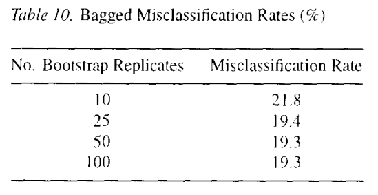

**Forward variable selection**

With data of the form $L={(y_n,\mathbf{x_n}),n=1...N}$ where $\mathbf{x}=(x_1,...,x_M)$ consists of M predictor variables, a popular prediction method consists of forming predictors $\delta_1(\mathbf{x})...\delta_M(\mathbf{x})$ where $\delta_m(\mathbf{x})$ is linear in **x** and depends on only m of the M x-variables.
Then one of the $\delta_m(\mathbf{x})$ is chosen as the designated predictor.
A common method for constructing the $\delta_m(\mathbf{x})$, and one that is used in our simulation, is forward variable entry.
If the variables used in $\delta_k(\mathbf{x})$ are $(x_{1k},...,x_{mk})$ then for each m $\notin {m_1,...m_K}$ form the linear regression of y on $(x_{m1},...,x_{mk+1}, x_m)$, compute the RSS(m) and take $x_{mk+1}$ such that $m_{k+1}$ minimizes RSS(m) and $\delta_{k+1}(\mathbf{x})$ the linear regression based on $(x_{m1},...,x_{mk+1})$.
What is clear about this procedure is that it is an unstable procedures.
The variables are competing for inclusion in the $\delta_m$ and small changes in the data can cause large changes in the $\delta_m$.
Forward variable selection is considered an unstable procedure due to the following reasons:

1.  Dependency on the order of variable selection: in forward variable selection, the procedure starts with an empty model and adds one variable at a time based on certain selection criteria.
    However, the initial selection of variables can significantly impact the final result.
    If the initial set of selected variables differs, the progressive selection of variables can lead to different models.
    Therefore, the selection of initial variables can cause instability in the results.

2.  Sensitivity to correlated variables: forward variable selection may be influenced by correlated variables.
    When adding a variable to the model, it may appear to provide significant informative value, but it could be strongly correlated with other variables already present in the model.
    This correlation can lead to an overestimation of the importance of the added variable and result in selecting a suboptimal model.

3.  Impact of small data variations: forward variable selection can be sensitive to small variations in the input data.
    Even a slight modification of the input data can lead to a completely different variable selection or a different model.
    This instability can make it challenging to reproduce the results.

To mitigate the potential instability of forward variable selection, techniques such as cross-validation or bootstrap can be used to assess the stability of selected variables and the robustness of the resulting model.
These techniques allow for a more accurate estimation of model performance and more reliable identification of the most relevant variables.

**Simulation structure**

In this paragraph we are going to use a simulated data drawn from the model y= $\sum_{m}\beta_mx_m+\epsilon$ where $\epsilon$ is N(0,1).
The number of variables is M=30 and the sample size is 60.
The subset selection is nearly optimal if there are only a few large non-zero $\beta_m$ , and its performance is poor if there are many small but non-zero $\beta_m$.
This is why subset selection can be effective in such cases:

1.  Focus on important predictors: subset selection methods aim to identify a subset of predictors that are most relevant for predicting the response variable.
    When there are only a few predictors with large non-zero coefficients, subset selection can successfully identify and include those important predictors in the model.

2.  Improved model interpretability: by selecting a subset of predictors with large non-zero coefficients, subset selection can lead to a more interpretable model.
    The resulting model will focus on the most influential predictors, providing insights into the relationship between these predictors and the response variable.

3.  Reduction in model complexity: by selecting a smaller subset of predictors, subset selection reduces the complexity of the model compared to including all predictors.
    This reduction in complexity can improve model generalization, making the model more robust and less prone to overfitting.

It's important to note that subset selection methods, like forward selection or backward elimination, are not guaranteed to find the exact optimal model in all cases.
They are heuristic approaches that explore different combinations of predictors.
The optimality of the selected model depends on factors such as the quality of the selection criteria and the sample size.
In practice, it's always recommended to evaluate the performance of the selected model using cross-validation or other validation techniques like bootstrap.
This helps to assess the model's predictive accuracy and determine if additional refinement or regularization techniques are needed.
In summary, when there are only a few large non-zero coefficients, subset selection methods can be effective in identifying the most important predictors and constructing a simpler, interpretable model.
However, it's crucial to validate the model and consider other factors to ensure its performance and reliability.

Three sets of coefficients are used in the paper's example.
In the first set of coefficients there are only three non-zero ${\beta_m}$.
In the second set of coefficients there are 15 non-zero ${\beta_m}$.
In the third set there are 27 non-zero ${\beta_m}$, all relatively small.
For each set of coefficients, the following procedure was replicated 250 times:

1\.
Data $L={(y_n,\mathbf{x_n}),n=1...60}$ was drawn from the model y=$\sum_{m}\beta_mx_m+\epsilon$.

2\.
Forward entry variables was done using L to get the predictors $\delta_1(\mathbf{x})...\delta_M(\mathbf{x})$.
The mean squared prediction error of each of these was computed giving $e_1...e_M$.

3\.
Fifty bootstrap replicates $L_B$ of L were generated.
For each of these, forward step-wise regression was applied to construct predictors ${\delta_1(\mathbf{x},L_B)...\delta_M(\mathbf{x},L_B)}$.
These were averaged over the $L_b$ to give the bagged sequence $\delta^B_1(\mathbf{X})...\delta^B_M(\mathbf{X})$.
The prediction errors $e^B_1...e^B_M$ for this sequence were computed.

These computed mean-squared-errors were averaged over the 250 repetitions to give the sequences ${\bar{e}^S_m},{\bar{e}^B_m}$.
For each set of coefficients, these two sequences are plotted vs m in Figure1 a,b,c.

{width="530"}

Looking at Figures1 a,b,c an obvious result is that the most accurate bagged predictor is at least as good as the most accurate subset predictor.
In the first set of coefficients (with only three non-zero ${\beta_m}$), subset selection is nearly optimal and there is no improvement.
In the second and third set of coefficients there is substantial improvement.
*Bagging can improve only if the unbagged is not optimal*.
Note that in all three graphs there is a point past which the bagged predictors have larger prediction error than the unbagged.
The explenation is this: linear regression using all variables is a fairly stable procedure.
The stability decreases as the number of variable used in the predictor decreases.
*For a stable procedure* $\delta_B= \delta_A(\mathbf{x},P_L)$ *is not as accurate as* $\delta(\mathbf{x},P)$.
As m decreases, the instability increases and there is a cross-over point at which $\delta^B_m$ becomes more accurate than $\delta_m$.

**Bagging class probability estimates**

Some classification methods estimate probabilities p(j\|**x**) that an object with prediction vector **x** belongs to class j.
Then the class corresponding to **x** is estimated as $argmax_jp(j|\mathbf{x})$.
For such methods, a natural competitor to bagging by voting is to average the p(j\|**x**) over all bootstrap replications, getting $p_B(j|\mathbf{x})$ and then use the estimated class $argmax_jp_B(j|\mathbf{x})$.
In some applications, estimates of class probabilities are require instead of, or along with, the classifications.
The evidence so far indicates that bagged estimates are likely to be more accurate than the single estimates.
To verify this, it would be necessary to compare both estimates with the true values p\*(j\|**x**) over the **x** in the test set.
For real data the true values are unknown but they can be computed for the simulated waveform data.
Using the waveform data, a simulation with learning and test sets both of size 300 and 25 bootstrap replications has been done.
In each iteration, the average of $|p(j|\mathbf{x})-p*(j|\mathbf{x})|$ and $|p_B(j|\mathbf{x})-p*(j|\mathbf{x})|$ was computed.
This was repeated 50 times and the results averaged.
The single tree estimated had an error of .189.
The error of the bagged estimates was .124, a decrease of 34%

the waveform data was ran using 10,25,50 and 100 replicates with the same simulation scheme.
The results appear in Table 10.{width="254"}
The unbagged rate is 29.1, so its clear that we are getting most of the improvement using only 10 bootstrap replicates.